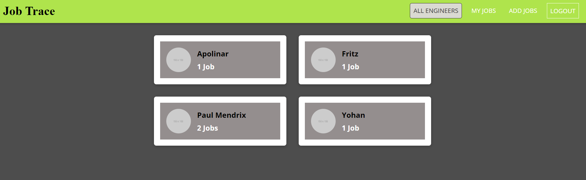
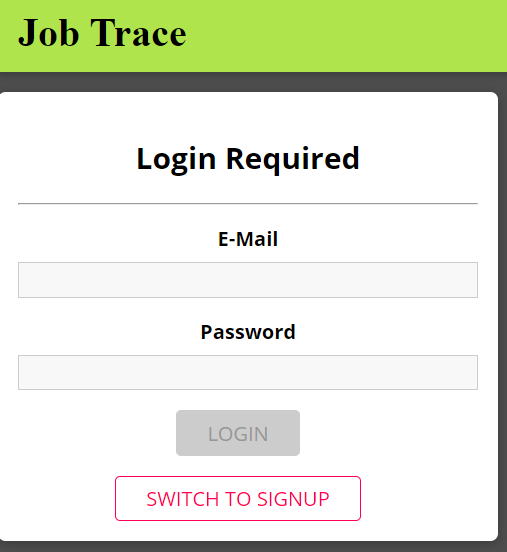
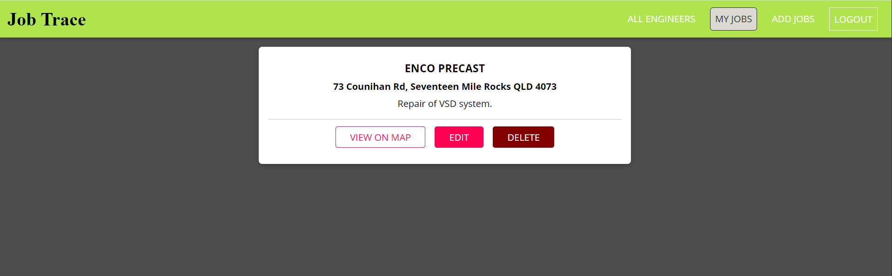

# Project-3 Job Trace

  

  ## Description 
  
  This application is a Job Trace application that can be used to store details of personnel activities in a given organization. In addition, this app could track team member activities on a system where entries are saved and concealed in a database.

  The Front-End is done using ReactJS utilizing basic concepts and hooks. The Back-End was written using ExpressJS, MongoDB, and Mongoose (Object Data Modelling for MongoDB and NodeJS). I created a Mongo database with a Mongoose schema and handle routes with Express. Programming of the application was done with separate folder for front-end and back-end application.
  
  
  ## Table of Contents
  
  * [Installation](#installation)
  * [Usage](#usage)
  * [License](#license)
  * [Contributing](#contributing)
  * [Tests](#tests)
  * [Questions](#questions)
  
  
  ## Installation
  
  The project requires that express and mongoose be installed in the local machine for the back end. On other hand, ReactJS and other related packages were installed in the front end. The full list of packages for both backpend and front end could be found in their respective package.json files.

  Nodemon was also installed as development dependency.
  
  
  ## Usage 
  
  The following image snapshots the functionality of the app.

  

  

  

  
  The application could be accessed using the following heroku link:

  https://test-website-prod-6998d.web.app/

  The repository for this application could be accessed using the following github link:

  https://github.com/apolinar1607/Project-3.git

  
  
  ## License
  
  Licensed by : [Apache](./utils/license-Apache)
  
  
  ## Contributing
  
  Not applicable.

  
  ## Tests
  
  To deploy it automatically, use the heroku link provided above.

  ## Questions
  
  Github Username: 
  [apolinar1607](https://github.com/apolinar1607)

  Please send me an email if you have any question(s): 
  apolinar.magtanong@gmail.com
  
  

  ---
  © 2021 JM Automation . All Rights Reserved.

